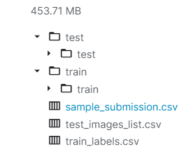
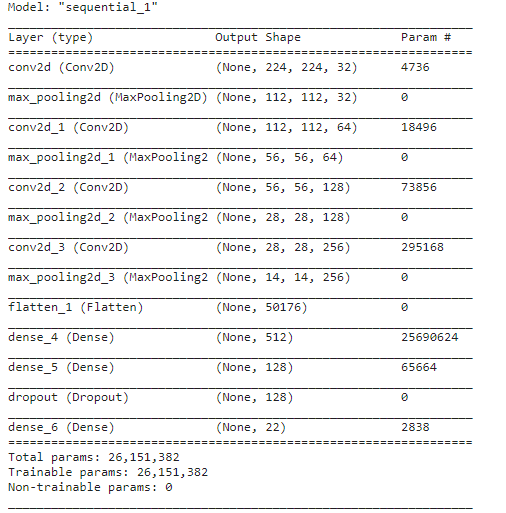
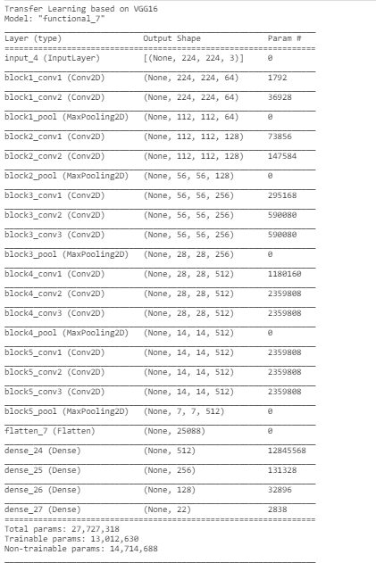

# Sports-Classification

## Overview

   This project is based on creating a image classifier which is trained for sports image dataset, from kaggle  "Sports Images Classification" competition.
### Motivation 
This project is heavily based on one of my past projects, SSD object detection https://github.com/PurvaChiniya/Single_shot_detector

## File Description:
* train.zip - the training set of images
* test.zip - the test set of images on which predictions are to be published
* sample_submission.csv - a sample submission file in the correct format
* train_labels.csv - contains the classes for the the training set images along with their path
* test_images_list.csv-upload your prediction on these images in the same order and format as given in sample_submission.csv

### Data directory
<p align="left">
  
</p>

## Models 

* CNN MODEL
 This is a simple 3 layer CNN model trained from scratch for 35 epocs. Learning rate is set to 0.00001 and reduced at a factor of 0.1. 
<p align="left">
  
</p>

* VGG16 Transfer Learning Model
This is a transfer learning model , with top layers from pretrained vgg16 and classification layers are added on top of that. Learning rate is 0.0001.
<p align="left">
  
</p>
 
### Steps to reproduce
   Clone this repo ```https://github.com/PurvaChiniya/sports-classification.git```, change to the current directory and run finalcode.py
